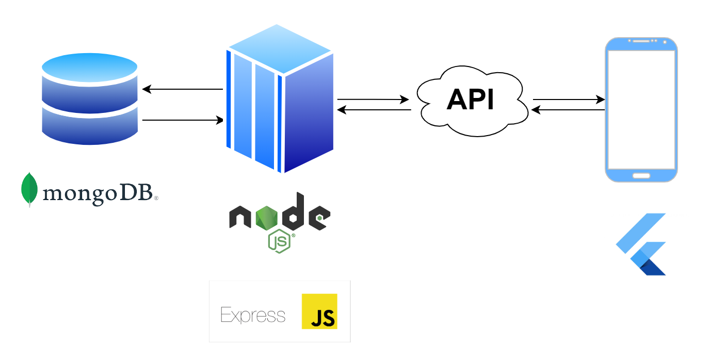

# Pakdoekang API

Project ini dibuat untuk menyelesaikan tugas akhir matakuliah Basis Data Non Relasional.

## Arsitektur

- Database

    Menggunakan MongoDB Compas yang berjalan di lokal.

- Backend

    Menggunakan NodeJS dan ExpressJS

- Frontend

    Menggunakan Flutter. Aplikasi yang terkait [Pakdoekang]("https://github.com/zumaku/pakdoekang/tree/trymongodb").
